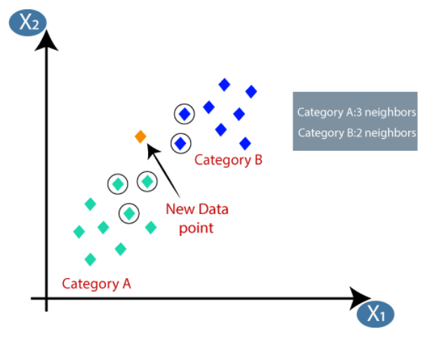
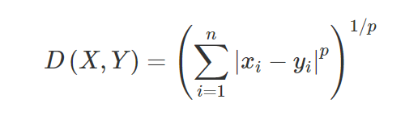
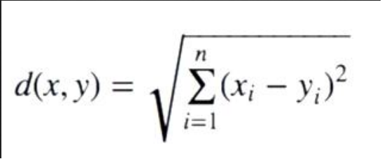
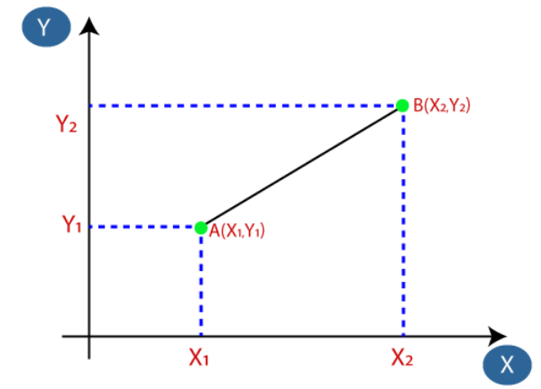
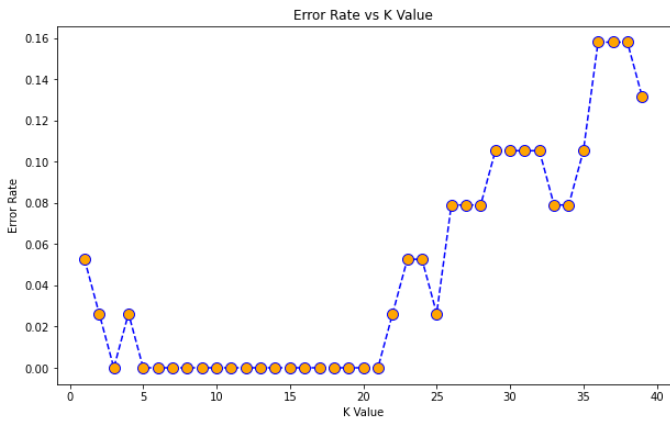

# K-Nearest-Neighbor-Algorithm-From-Scratch
# 1. Introduction

The k-nearest neighbor (KNN) is an easy to implement surpervised machine learning algorithm that can be used to solve both classification and regression problem. The iris dataset has been used for this project as it is a built in dataset inside the sklearn library.

# 2. Objective

To store all the available data and classifies a new data point based on similarity.

# 3. K-NN Algorithm

* The figure above shows the two different categores of data A and B, a new data point is added. 
* The category of the new data point is determined by    calculating the distance between two points. 
* There are several types of distance metrics. In this project I have implemented two of those which is Eulidean Distance which is the most popular and the Minkowski Distance.

Minkowski Distance

Euclidean Distance

* By calculating Minkowski Distance or Euclidean Distance we can find the category of the new data point.

* We can determine the value of K by iterating through a start point and end point 
* The best K value is the one with the lowest error rate.

 
# 4.Application of KNN

* Climate Forecasting 🌧
* Stock market Forecasting 📈
* Estimating soil water parameter 🌱

# 5.Advantages

* Robus to noisy training data
* Effective if the training data is large
* Learns complex models easily
* There is no training phase

# 6.Disadvantages

* It gets slower if the number of independant variables increases
* Need to determine the value of parameter K
* Accuracy depends on quality of the data
* Requires large amount of data and storage to store all the training data
* Sometimes the distance between data objects become less distinct
* Please do check my hand written notes and my implementation in KNN using iris dataset  for more detailed information.
